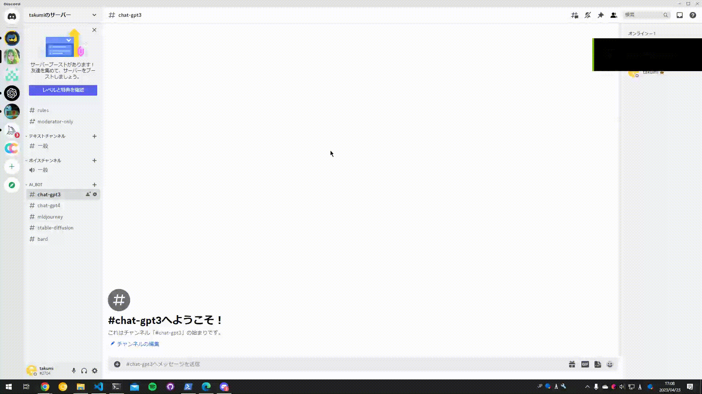
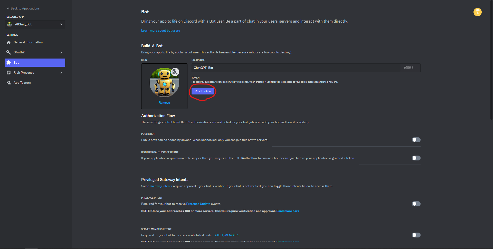
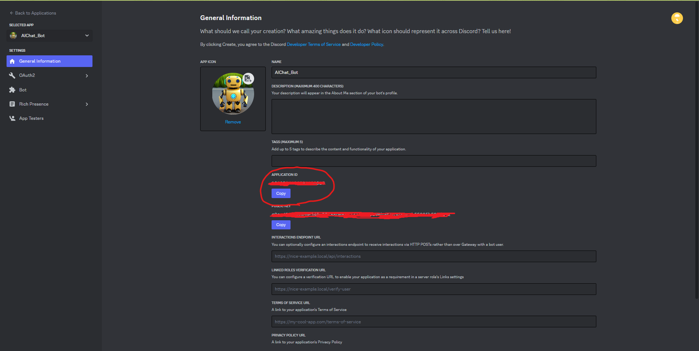
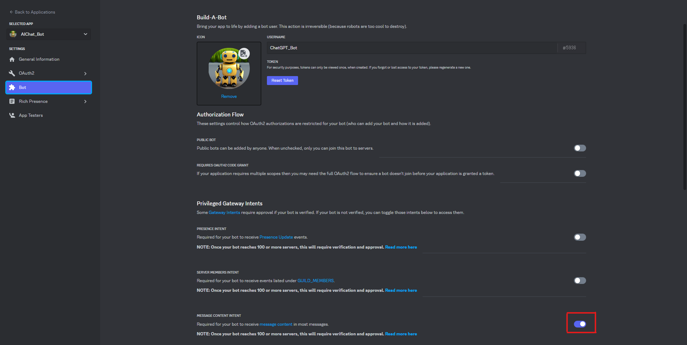
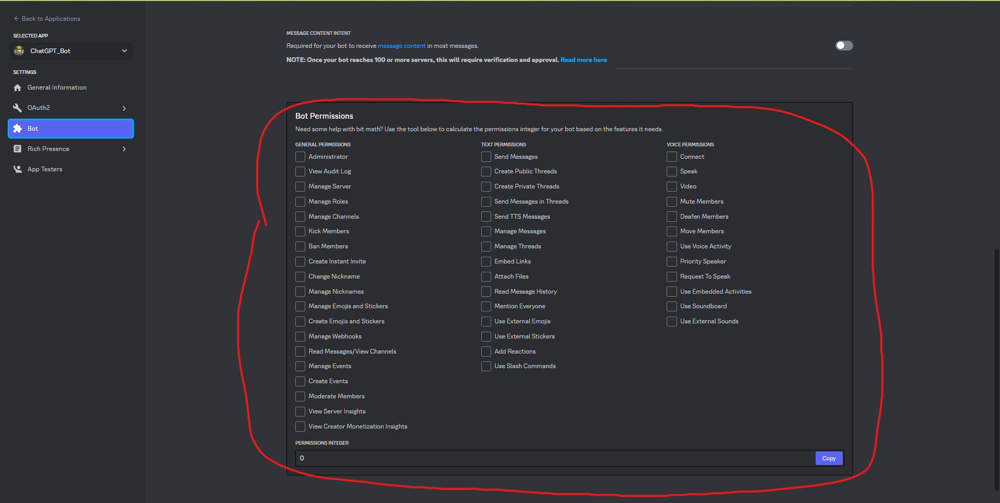
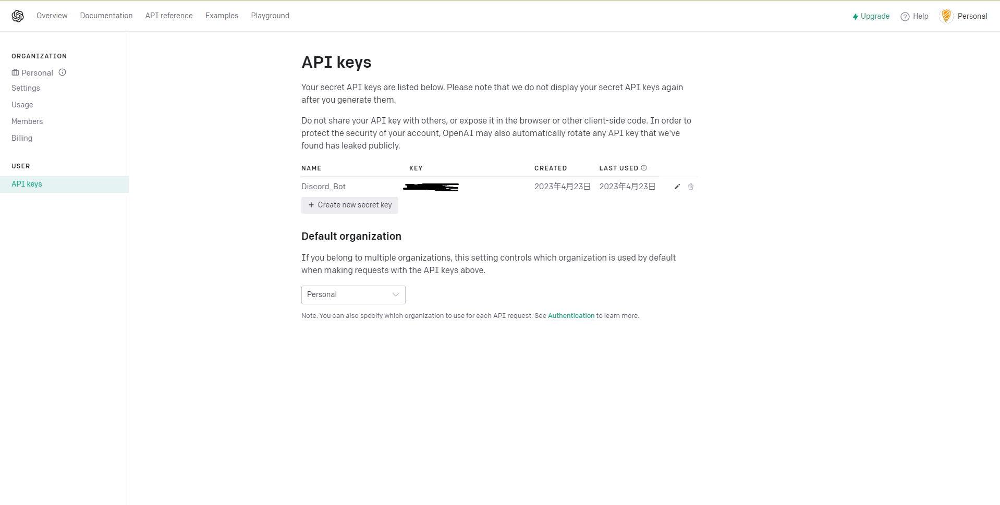

# DiscordBot with ChatAI
* Discordでの投稿に対する各ChatAIの返答を投稿するBot

* BardおよびChatGPT4は順番が回ってくるまで使えない

* Bardは現在英語での質問のみ対応

* ChatGPTとの接続ライブラリには公式のopenaiではなくrevChatGPTを使用

* Bardとの接続ライブラリにはGoogleBardを使用

---

## 使い方
### ChatGPT

### Bard


---

## 設定
1. python(>3.10)のインストール
1. 必要ライブラリのインストール  
`pip install requiements.txt`
1. DiscordのBot作成及びToken取得  
作成方法は[ここ](https://discordpy.readthedocs.io/ja/latest/discord.html)を参照  
アクセストークンを取得

アプリIDをコピー

インテントを有効化

Botをサーバに追加する
* URL(add_bot.url)を編集し、URLを開くことでBotがサーバに追加される  
client_idのパラメータにアプリIDを入れる  
必要であればpermissionsの値を変更する  
必要となる権限に応じたpermissionの値は以下で計算できる

```
必要権限は以下の通り
    * Read Messages/View Channels
    * Send Message
    * Send Messages in Threads
    * Attach Files
    * Read Message History
    * Use Slash Commands
```
1. Discordサーバに専用チャンネルを作成
    * OpenAIのアカウント作成及びAPI-Key取得  
    [OpenAI-API Keys](https://platform.openai.com/account/api-keys)から取得(※API-KEYの名前は何でも良い)
    
    * Bardのアクセストークンを取得
        1. `https://bard.google.com/`を開く
        2. F12を押してクッキー一覧を開く
        3. `__Secure-1PSID`の値をコピー
1. config.yamlの設定
    * DiscordのBOTトークンとチャンネルIDの設定
        * `DISCORD_BOT_TOKEN`
        * `CHANNEL_ID`
    * OpenAIのAPI KEY設定
        * `OPENAI_ACCESS_KEY`に`API-Key`の値を設定する
    * Bardのアクセストークン設定
        * `BIRD_ACCESS_TOKEN`に`__Secure-1PSID`の値を設定する
1. main.pyを実行

---

## File list
```
|--main.py             : Discordのチャット送受信
|--Req_Dest            : 各AIサービスへのリクエストの送受信(一部未作成)
|   |--ChatGPT_API.py  : API経由でChatGPTと通信
|   |--ChatGPT_Web.py  : Web画面経由でChatGPTと通信
|   |--Bard.py         : Bardと通信
|   |--Bing.py         : BingAIと通信(未作成)
|--config.yaml         : 設定ファイル
|--ReadMe.md           : このファイル
|--requirements.txt    : 必要ライブラリ
```
